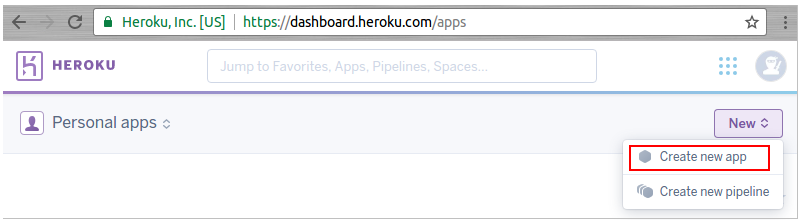
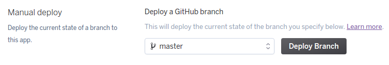
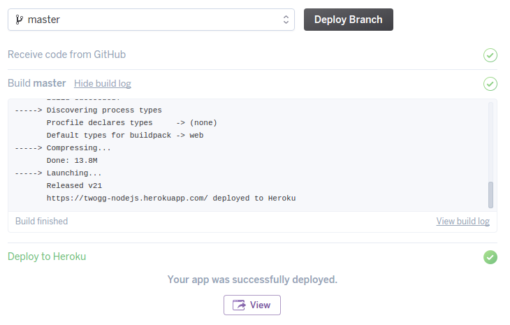

## NodeJs + Heroku
Simple hello-world app deployed on Heroku. [Hello-World App](https://twogg-nodejs.herokuapp.com/).

### What is Heroku
Heroku is a cloud Platform-as-a-Service (PaaS) supporting several programming languages that are used as a web application deployment model. Heroku is one of the first cloud platforms, it has been in development since June 2007, when it supported only the Ruby programming language, but now supports Java, Node.js, Scala, Clojure, Python, PHP, and Go.

#### Create New App
First you need to create an account on [Heroku](https://www.heroku.com/), It's free so go ahead an try!. Login then go to apps option, now we click create app button. You only need an App Name and a region to deploy the App. Currently are USA and Europe runtime regions.



### Deploy

#### Deployment method
Heroku Git: Use Heroku CLI, to use this option you need to follow [Heroku's started guide](https://devcenter.heroku.com/articles/getting-started-with-nodejs#set-up).
GitHub: Connect your GitHub repo with Heroku. This is the easier one, first, you need to grant Heroku access, then select the repo and branch to deploy. 
Dropbox: Use your source code storage in Dropbox.


#### GitHub
Some functionalities when you use GitHub are Code diffs, manual and auto deploys, and activity feed.

#### Automatic deploys
Enables a chosen branch to be automatically deployed. Very useful if you have a production branch ready.

#### Manual deploy
Deploy the current state of your selected App's branch.



### Build Log
Very useful tool to follow your App's building.

```sh
-----> Node.js app detected
-----> Creating runtime environment
       ...
-----> Installing binaries
       engines.node (package.json):  unspecified
       engines.npm (package.json):   unspecified (use default)
       ...
-----> Building dependencies
       Installing node modules (package.json)
-----> Caching build
       Clearing previous node cache
       Saving 2 cacheDirectories (default):
       - node_modules
       - bower_components (nothing to cache)
-----> Build succeeded!
-----> Discovering process types
       Procfile declares types     -> (none)
       Default types for buildpack -> web
-----> Compressing...
       Done: 13.8M
-----> Launching...
       Released v22
       https://twogg-nodejs.herokuapp.com/ deployed to Heroku
```



More Info and references:
[Heroku's About page](https://www.heroku.com/about) and [Wikipedia](https://en.wikipedia.org/wiki/Heroku).
